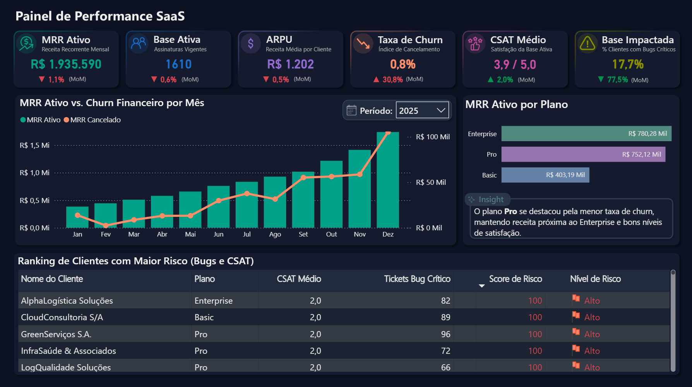
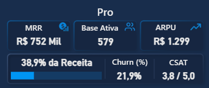
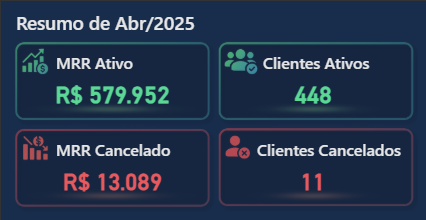
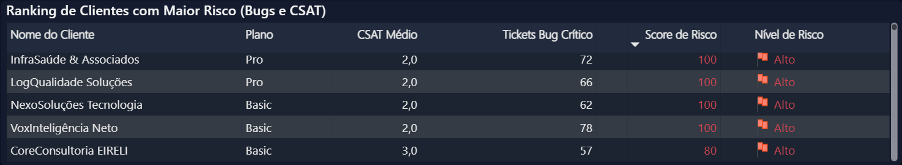

# Dashboard Performance SaaS

Dashboard em Power BI para analisar a performance de um negócio SaaS, acompanhando receita recorrente, churn, satisfação dos clientes, bugs críticos e clientes com maior risco.

O projeto passa pela preparação dos dados em SQL, criação de medidas em DAX e construção de um painel interativo no Power BI.



---

## Sobre o projeto

A ideia deste projeto foi montar uma visão clara da operação de um SaaS, reunindo indicadores financeiros, comportamento da base e sinais de risco dos clientes.

O dashboard ajuda a responder perguntas como:

* Quanto de receita recorrente está ativa?
* Como o churn evoluiu ao longo do tempo?
* Quais planos concentram mais receita?
* Quantos clientes foram impactados por bugs críticos?
* Quais clientes precisam de mais atenção?

---

## Métricas analisadas

O dashboard acompanha os seguintes indicadores:

* **MRR Ativo**: receita recorrente mensal dos clientes ativos.
* **MRR Cancelado**: receita associada aos clientes cancelados no período.
* **Base Ativa**: quantidade de clientes com assinatura vigente.
* **ARPU**: receita média por cliente ativo.
* **Taxa de Churn**: percentual de clientes cancelados.
* **CSAT Médio**: média de satisfação dos clientes.
* **Base Impactada**: percentual de clientes ativos com bugs críticos.
* **Score de Risco**: pontuação criada para priorizar clientes com baixo CSAT e/ou muitos bugs críticos.

As regras usadas nas métricas estão no arquivo [`docs/metricas-e-regras.md`](docs/metricas-e-regras.md).

---

## Ferramentas utilizadas

* Power BI
* DAX
* SQL
* PostgreSQL
* Supabase
* Excel

---

## Prévia do dashboard

### Visão geral


### Tooltip por plano



### Tooltip por período



### Ranking de clientes em risco



---

## O que foi trabalhado no dashboard

Alguns pontos construídos no projeto:

* Cards com os principais KPIs do negócio.
* Gráfico de evolução do MRR ativo e MRR cancelado.
* Alternância entre visão anual e mensal no gráfico principal.
* Títulos dinâmicos de acordo com o período analisado.
* Tooltips personalizados para detalhar períodos e planos.
* Ranking de clientes com maior risco.
* Insight sobre o plano com melhor combinação de receita, churn e satisfação.

---

## Dados e consultas SQL

Os dados foram estruturados em um banco PostgreSQL no Supabase.

As consultas usadas para preparar as tabelas de apoio estão na pasta [`sql/`](sql/). Elas foram usadas para montar:

* a base de clientes;
* o comportamento mensal dos clientes;
* o histórico mensal de MRR, clientes ativos e clientes cancelados;
* a visão atual de MRR por cliente, considerando a assinatura mais recente.

Arquivos principais:

```text
sql/
├── clientes.sql
├── comportamento-clientes.sql
├── mrr-historico.sql
└── mrr-atual-clientes.sql
```

---

## Estrutura do repositório

```text
dashboard-performance-saas/
│
├── dashboard/
│   └── dashboard-performance-saas.pbix
│
├── docs/
│   └── metricas-e-regras.md
│
├── images/
│   ├── visao-geral.png
│   ├── tooltip-plano.png
│   ├── tooltip-periodo.png
│   └── ranking-risco.png
│
├── sql/
│   ├── clientes.sql
│   ├── comportamento-clientes.sql
│   ├── mrr-historico.sql
│   └── mrr-atual-clientes.sql
│
├── LICENSE
└── README.md
```

---

## Decisões do projeto

### Eixo temporal dinâmico

O gráfico principal muda automaticamente entre visão anual e mensal.

Quando nenhum ano está selecionado, o gráfico mostra os anos da base. Quando um ano é selecionado, o eixo passa a mostrar os meses daquele ano.

Isso evita criar dois gráficos separados para a mesma análise.

### Score de risco

O score de risco foi criado para organizar os clientes que merecem mais atenção.

A pontuação considera:

* quantidade de tickets de bug crítico;
* CSAT médio do cliente.

A ideia não foi criar um modelo estatístico de previsão de churn, mas uma regra simples, fácil de explicar e útil para priorização.

### Tooltips personalizados

Os tooltips foram usados para mostrar mais detalhes sem sobrecarregar a tela principal.

O tooltip por período mostra:

* MRR Ativo;
* Clientes Ativos;
* MRR Cancelado;
* Clientes Cancelados.

O tooltip por plano mostra:

* MRR;
* Base Ativa;
* ARPU;
* participação na receita;
* churn;
* CSAT.

---

## Insights encontrados

Alguns pontos observados na análise:

* O plano **Pro** teve a melhor combinação entre churn, receita e satisfação.
* O plano **Enterprise** concentra a maior receita, mas também apresentou o maior churn.
* A métrica de Base Impactada ajuda a medir o efeito dos bugs críticos sobre os clientes ativos.
* O ranking de risco facilita a identificação de clientes com baixo CSAT e alta quantidade de bugs críticos.

---

## Como visualizar

O arquivo do dashboard está na pasta [`dashboard/`](dashboard/).

Para abrir o projeto, basta baixar o arquivo `.pbix` e abrir no Power BI Desktop.

---

## Aprendizados

Durante o desenvolvimento, trabalhei principalmente com:

* consultas SQL para preparação dos dados;
* modelagem de dados para análise histórica;
* criação de medidas DAX;
* tratamento de contexto de filtro no Power BI;
* criação de KPIs de negócio;
* uso de tooltips personalizados;
* organização de um projeto de BI para portfólio.

---

## Observação

Projeto desenvolvido para estudo e portfólio, usando uma base simulada de uma operação SaaS.
